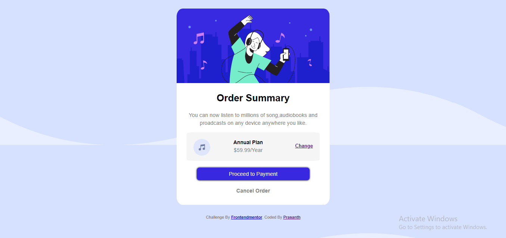

# Frontend Mentor - Order summary card solution

This is a solution to the [Order summary card challenge on Frontend Mentor](https://www.frontendmentor.io/challenges/order-summary-component-QlPmajDUj). Frontend Mentor challenges help you improve your coding skills by building realistic projects. 

## Table of contents

- [Overview](#overview)
  - [The challenge](#the-challenge)
  - [Screenshot](#screenshot)
  - [Links](#links)
- [My process](#my-process)
  - [Built with](#built-with)
  - [What I learned](#what-i-learned)
  - [Useful resources](#useful-resources)
- [Author](#author)
- [Acknowledgments](#acknowledgments)

## Overview

This is a solution to the [Order summary card challenge on Frontend Mentor](https://www.frontendmentor.io/challenges/order-summary-component-QlPmajDUj). Frontend Mentor challenges help you improve your coding skills by building realistic projects. 

### The challenge

Users should be able to:

- See hover states for interactive elements

### Screenshot

## My process

### Links

- Solution URL: [Add solution URL here](https://your-solution-url.com)
- Live Site URL: [Add live site URL here](https://your-live-site-url.com)

### Built with

- Semantic HTML5 markup
- CSS custom properties
- Flexbox

### What I learned

I have learned more in detail about HTML and CSS from this site, especially I have learned more about box alignment,CSS properties etc from building of this site. Practicing and doing the project will built your knowledge in specific topic and become professional in that.

### Useful resources

- [W3-Schools](https://www.w3schools.com/css/) - This helped me a lot to build this site.
- [MDN Web Docs](https://developer.mozilla.org/en-US/docs/Web/CSS) 

## Author

- Frontend Mentor - [@prasanthk99](https://www.frontendmentor.io/profile/prasanthk99)

## Acknowledgments

Frontend Mentor - This is where you can give a hat tip to anyone who helped you out on this project. Perhaps you worked in a team or got some inspiration from someone else's solution. This is the perfect place to give them some credit.

